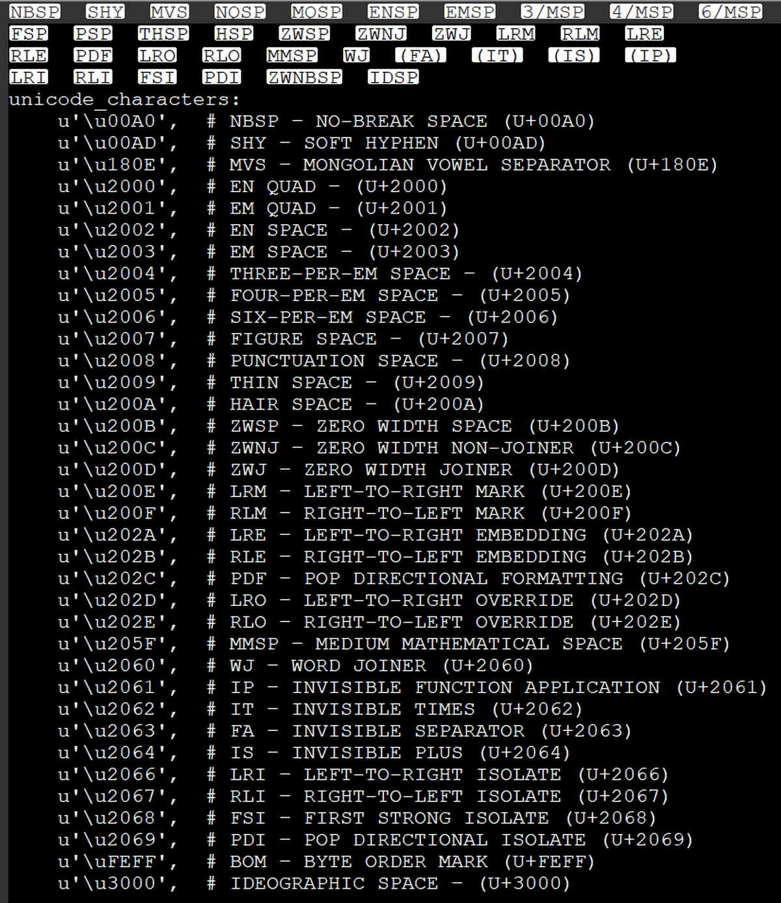
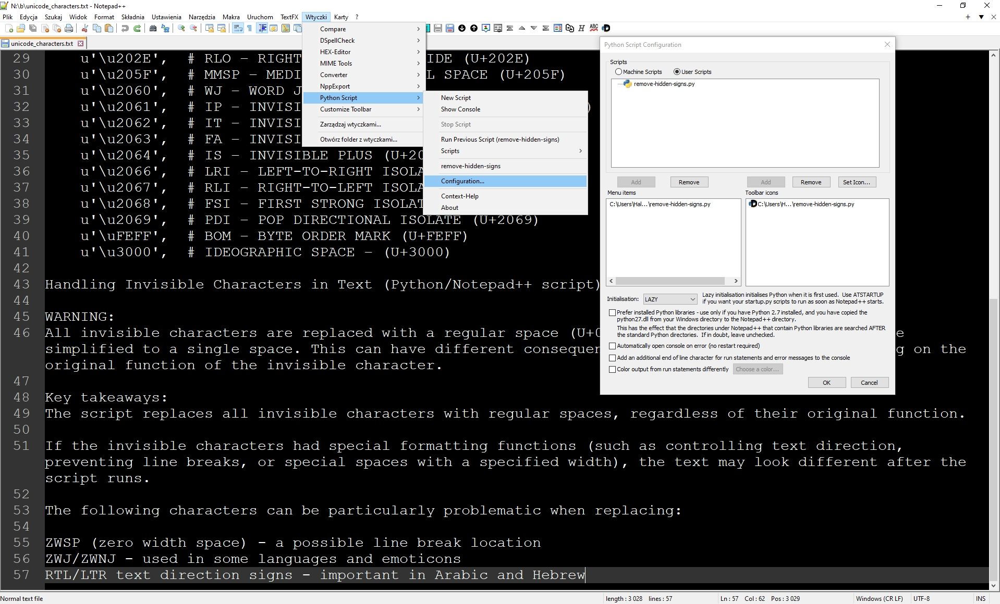

Handling (remove) Invisible Characters in Text (Python/Notepad++ script)

WARNING: 	
All invisible characters are replaced with a regular space (U+0020), and then multiple spaces are simplified to a single space. This can have different consequences for text formatting, depending on the original function of the invisible character.

Key takeaways:
The script replaces all invisible characters with regular spaces, regardless of their original function.

If the invisible characters had special formatting functions (such as controlling text direction, preventing line breaks, or special spaces with a specified width), the text may look different after the script runs.

The following characters can be particularly problematic when replacing:

ZWSP (zero width space) - a possible line break location
ZWJ/ZWNJ - used in some languages and emoticons
RTL/LTR text direction signs - important in Arabic and Hebrew




******************************
Go to [https://github.com/bruderstein/PythonScript/releases](https://github.com/bruderstein/PythonScript/releases) (go to Assets) and download dll Python_Script pack and install. Then install remove-hidden-signs.py user script.
***
## Plugin Installation and Usage

Installation

Installation is very simple, either through PluginAdmin, or manually.  The zip archive contains the 
files in the correct layout - just copy to your Notepad++ directory (e.g. `c:\\Program Files\\Notepad++`)

The file layout is as follows::

	Notepad++            (your main Notepad++ directory, probably under "C:\Program Files")
	 +
	 |
	 +-- plugins
			\
			|
			|-- PythonScript
			|   \
			|   |
			|   |-- PythonScript.dll
			|   |
			|   |-- python312.dll         (maybe not necessary if you have a Python installation already, in which case it is probably in C:\windows )
			|   |
			|   |-- lib
			|   |    \
			|   |    |-- (*.py)   lots of *.py files and subdirectories
			|   |
			|   |-- scripts
			|   |	\
			|   |	|-- (machine-level scripts)
			|   |
			|   |-- doc
			|        \
			|        |-- PythonScript
			|             \
			|             |-- index.html        (optional, if it is not there context-sensitive help will use the web)
			|
			|
			|
			|-- Config     (this config directory can also be in %APPDATA%\Notepad++\plugins\config\)
				|
				\-- PythonScript
						 \
						 |-- scripts
							   \
							   |-- (user level scripts go here)


## Usage


To use Python Script, you'll first need to create a script.  Click New Script from the Python Script menu in the Plugins menu.
This creates a new user script (in your config directory).  When you've typed your script out, you can run it from the `Scripts` submenu.

*The `Scripts` submenu is automatically updated whenever you save a script, so if you copy a file into the scripts directory manually, 
you'll need to make a change (a dummy new line or comment etc) and save a script (any will do) in Notepad++ for it to update.*

To edit the script, just hold Ctrl down and click the script in the `Scripts` menu.  

If you click `Configuration`, you can assign the script either to a toolbar icon, or to the Python Script menu itself.  If you assign a 
script to the menu, then it will appear immediately, but you will not be able to assign a shortcut to it until next time Notepad++ starts.

If you assign it to a toolbar icon, then it will only appear on the next start of Notepad++.

Context-Sensitive help is available - if your cursor is on a notepad, editor or console function, the ``Context-Help`` menu
will take you straight to the documentation for that function.  If the help files are not in the relevant location from layout above, it will open the 
documentation from the web.


## Startup

.. _startup.py:

The script called startup.py (in either the "machine" directory or "user" directory - see Installation_) is run when Python Script
starts up.  Normally, that is the first time a script is called.  The default startup.py script does some small things like directing 
the error output to the console, and importing some commonly used modules.  

If you want to register a callback (see :ref:`Notifications`) to run from when Notepad++ starts up, you need to change the startup type
to ATSTARTUP, instead of LAZY.  You can do this in the Configuration dialog.
******************************************************************************
 # NPP Text Rewrap 
## For Notepad++ 64-bit, there is no official plugin for “Rewrap”, but you can work around this by writing a small Python script yourself.

1. Open Plugins > Plugin Management.
2. Search for and install PythonScript.

Python Script plugin.
Author: Dave Brotherstone + Jocelyn Legault
Homepage: https://github.com/bruderstein/PythonScript

3. wirte script: [Re-wrap script (e.g., 82 characters)]
   
```
import textwrap
editor.beginUndoAction()
try:
    start, end = editor.getSelectionStart(), editor.getSelectionEnd()
    text = editor.getTextRange(start, end)
    wrapped = '\r\n'.join(textwrap.wrap(text, 82))
    editor.replaceSel(wrapped)
finally:
    editor.endUndoAction()
```

4. In Notepad++, open Plugins > PythonScript > Scripts > New Script.
5. Paste the code and save it as “rewrap82.py”, for example.
6. Select the text and run the script.

## Example:

Text before:

```
Lorem ipsum dolor sit amet, consectetur adipiscing elit. Vestibulum suscipit, lorem id cursus malesuada, urna enim cursus ex, id viverra lacus quam non eros. In vitae ullamcorper est.
```

After the operation, divide into equal lines of 82 characters:

```
Lorem ipsum dolor sit amet, consectetur adipiscing elit. Vestibulum suscipit,
lorem id cursus malesuada, urna enim cursus ex, id viverra lacus quam non eros. In
vitae ullamcorper est.
```
# Please note:
This tool works blindly on the ENTIRE TEXT—if the text already has line breaks, they will be ignored, and the line will be divided evenly every 82 characters, regardless of words (it may cut in the middle of a word!).

## Another way

Quick guide — splitting into lines every n characters using “Find and Replace”:
Select the text you want to split/wrap.

Open Find and Replace (Ctrl+H).

Change the mode to Regular Expression!.

In the Find field, enter:
```
(.{82})
```
(or another number, e.g. 80, 60 – whatever length of line you want)

In the Replace field, enter:
```
\1\r\n
```
(i.e., after each “piece” of 82 characters, start a new line)

Click Replace All.
